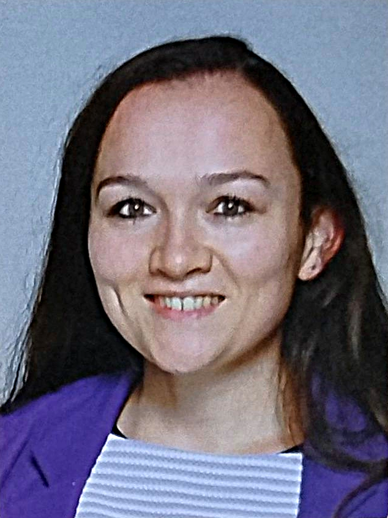

```{r setup, include=FALSE}
knitr::opts_chunk$set(echo = TRUE, warning = FALSE, message = FALSE)
```

{width=200px fig-align="center" style="border-radius: 50%;"}

My name is Xynthia Kavelaars. Currently, I am working at the Department of Theory, Methodology, and Statistics at the Open University of the Netherlands. Next to teaching methodology and statistics to our ambitious and eager psychology students [^1], I am doing research on research. Specifically, I am focusing on improving study design & statistical analysis, aiming for more efficient use of information and data. While this might sound counter-intuitive in an era where data are abundant and information is everywhere, high-quality data that answer relevant research questions rigourously can be sparse. Therefore, collecting and analyzing data wisely remains important - no matter how big data have become in recent years or will become in the future.

My specific focus is on:

- *Multivariate analysis*: Multiple outcomes often share information. We often ignore this information, which might lead to missing out on interesting patterns. My goal is to develop statistical analysis methods that benefit from the shared information between them to make these patterns visible and improve statistical decisions.
- *Adaptive study design*: Study planning is vital! Estimating the number of required observations prior to studies is difficult. Sample size computations rely on quantities that are often unknown or - in a best case scenario - uncertain. After all, if we would know the size of an effect with sufficient precision, the trial would not be needed. Incoming information during the trial can be used to adjust the study design if needed and when done appropriately. I am working on methods to revisit planned sample sizes without giving up on methodological rigor.


# Let's connect!

Interested in collaboration or just want to share your thoughts? I am happy to hear from you and to explore possibilities. Feel free to contact me in one of the ways below! 

```{r contact, echo = FALSE, results = 'asis'}
library(fontawesome)

cat(paste0(
  '<div style="display:flex; gap:20px;">',
  
  '<a href="https://github.com/XynthiaKavelaars/bmco" target="_blank">',
  fa("github"), ' Github</a>',

  '<a href="https://bsky.app/profile/xynthia-kavelaars.bsky.social" target="_blank">',
  fa("bluesky"), ' BlueSky</a>',
  
  '<a href="https://mastodon.social/@xynthiakavelaars" target="_blank">',
  fa("mastodon"), ' Mastodon</a>',
#  
#  '<a href="https://mastodon.social/@xynthiakavelaars" target="_blank">',
#  fa("blog"), ' Blog</a>',
  
  '<a href="www.linkedin.com/in/xynthia-kavelaars-7a0377129" target="_blank">',
  fa("linkedin"), ' LinkedIn</a>', 

  '<a href="https://orcid.org/0000-0003-1600-3153" target="_blank">',
  fa("orcid"), ' ORCID</a>', 

  '</div>'
))
```

[^1]: I would like to make a shout-out to our students! How cool and inspiring is it that they keep learning, no matter the life phase they're in? Whether they're working parents aiming for a career change, retirees hungry to learn more about some topic, or young adults needing a bit more flexibility: They're managing it all!
